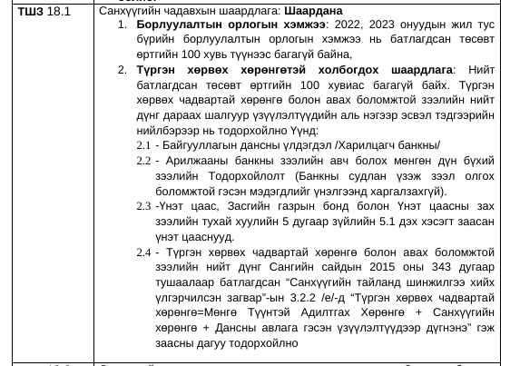

# RookieSystem-RAG

Би тендерийн баримт бичгээс өгөгдсөн хайлттай холбоотой мэдээллүүдийг олж, буцаах даалгавар авсан. Эхний ээлжинд тект файлаас `Санхүүгийн чадавхи` болон `Ижил төстэй бараа` мэдээллүүдийг буцаах байсан. Уг даалгаврыг би дараах схемийн дагуу гүйцэтгэж анхан шатны үр дүнд хүрсэн.

Туршилтууд:
- ChatGPT-д шууд `.pdf` файл оруулж дотроос нь асуултууд асуусан. Үүний үр дүн [chapgpt_motivation](./chatgpt_motivation/) фолдерт байгаа.
- ChatpGPT 3.5 API ашиглах гэсэн боловч төлбөртэй байсан тул чадаагүй.
- Иймд гараас оруулсан pdf файлыг:
    1. [Жижиг хэсгүүдэд хувааж](https://python.langchain.com/v0.1/docs/modules/data_connection/document_transformers/recursive_text_splitter/), хэсэг бүрийн [bayartsogt/albert-mongolian](https://huggingface.co/bayartsogt/albert-mongolian) ашиглан вектор огторгуйд проекц хийсэн (embedding).
    2. Дараагаар нь FAISS болон Chroma вектор өгөгдлийн санд хадгалсан.
    3. Эцэст нь өгөгдсөн хайлттай (propmt, query-тэй) ойр буюу төстэй мэдээллийг текстийн embedding хадгалсан сангаас олсон.

Одоогын байдлаас `Санхүүгийн чадавхи` хувьд асуудалтай хэдий ч дажгүй үр дүн буцааж байгаа. Жишээ нь дараах хэсэг бол санхүүгийн чадавхтай холбоотой хэсэг юм.

Үүнээс 

`санхүүгийн чадавхийн шаардлагад ямар баримт бичиг хамаарах вэ` 

хайлтыг хийхэд буцаасан хэсгүүдийн дээрээсээ 4, 5 дахь [дараах хэсгүүд болно](./manual_approach_v2.ipynb):

<b>Дээрээсээ 4 дэх нь</b>

2.1- Байгууллагын дансны үлдэгдэл /Харилцагч банкны/
2.2-  Арилжааны  банкны  зээлийн  авч  болох  мөнгөн  дүн  бүхий  
зээлийн  Тодорхойлолт  (Банкны  судлан  үзэж  зээл  олгох  
боломжтой гэсэн мэдэгдлийг үнэлгээнд харгалзахгүй). 
2.3-Үнэт  цаас,  Засгийн  газрын  бонд  болон  Үнэт  цаасны  зах  
зээлийн тухай хуулийн 5 дугаар зүйлийн 5.1 дэх хэсэгт заасан  
үнэт цааснууд. 
2.4-  Түргэн  хөрвөх  чадвартай  хөрөнгө  болон  авах  боломжтой  
зээлийн  нийт  дүнг  Сангийн  сайдын  2015  оны  343  дугаар  
тушаалаар батлагдсан “Санхүүгийн тайланд шинжилгээ хийх  
үлгэрчилсэн загвар”-ын 3.2.2 /е/-д “Түргэн хөрвөх чадвартай  
хөрөнгө=Мөнгө  Түүнтэй  Адилтгах  Хөрөнгө  +  Санхүүгийн  
хөрөнгө + Дансны авлага гэсэн үзүүлэлтүүдээр дүгнэнэ” гэж  
заасны дагуу тодорхойлно

 <b>- Gary Provost</b> <i>(100 Ways to Improve Your Writing, 1985)</i>

<b>Дээрээсээ 5 дахь нь</b>

хөрөнгө=Мөнгө  Түүнтэй  Адилтгах  Хөрөнгө  +  Санхүүгийн  
хөрөнгө + Дансны авлага гэсэн үзүүлэлтүүдээр дүгнэнэ” гэж  
заасны дагуу тодорхойлно
ТШЗ 18.2Санхүүгийн  чадавхыг  хянан  үзэхэд  үндэслэл  болгох  баримт  
бичиг:Шаардана
1.Зээлийн  мэдээллийн  тухай  хуулийн  4.1.5-д  заасан  зээлийн  
мэдээллийн  үйлчилгээ  үзүүлэх  этгээдээс  тендер  шалгаруулалт  
зарласан өдрөөс хойш авсан, шалгах боломжтой QR код бүхий  
“Зээлийн  мэдээллийн  сангийн  тодорхойлолт”-ыг  ирүүлнэ.  Уг  
тодорхойлолтод төлөгдөж дуусаагүй зээлийн мэдээлэл “Хэвийн”  
бус  байгаа  тохиолдолд  татгалзах  үндэслэл  болно.  (“Зээлийн  
мэдээллийн  сангийн  тодорхойлолт”-ыг  www.sainscore.mn,  
www.burenscore.mn  хаягаар  хандан  авна.  Харилцагч  банкны  
тодорхойлолтыг тендерийг үнэлэхэд харгалзан үзэхгүй.)

 <b>- Gary Provost</b> <i>(100 Ways to Improve Your Writing, 1985)</i>

> **_NOTE:_** Цаашид google translate api ашиглан гараас оруулсан текст (document)-г англи хэл рүү орчуулан, өөр embedding модел турших.
